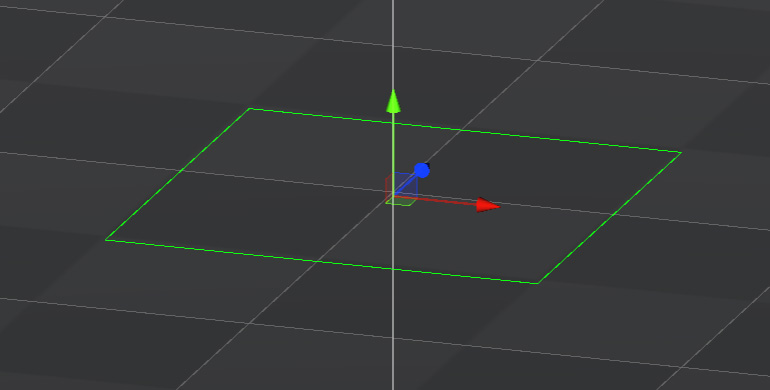

# 动态骨骼制作指南 v1.0
## 一.前言
对于使用动态骨骼或者布料模拟,需要有一个前提概念,无论使用哪种模式想要完全无穿插,并且拥有一个很自然的布料效果,并不是只靠插件就能完成的,美术资源上的约束和调整也是必须的,目前市面上诸多产品也是忽略了很多穿插明显的问题

## 二. 模型布线
对于需要使用动态骨骼的网格,需要有一些注意的地方,在不会出现穿插的情况下尽量使网格在**蒙皮时处于自然重力下垂状态**(除非需要有特殊的美术造型),以避免在应用动态骨骼后因重力而出现明显网格拉扯
- 臀部里外拓扑经量一致
  
- 长裙摆必须有一个开口，目的是防止角色做劈腿动作时模型拉扯 ，不可包成桶装
  
- 遇到多层结构时布线里层外层保持一致且布线平均，尽可能避免三角面
  
- 布料部分拓扑工整
  
  
- 布料与身体之间保持一定距离，建议是4-5厘米宽（两到三手指宽度）
  
- 袖口，裙摆底部等部位，请勿按照传统模型制作方式将其封闭，采用开放的面即可
  
## 三. 骨骼架设
### 架设方式
对于动态骨骼的骨骼架设方法,可根据以下类型进行不同架设,以下方案只针对保证简单动作下不穿插,因为目前设计的动作较复杂,对于骨骼架设模式可多做尝试适应各种动作
#### 3.1 基础
- 对于骨骼架设,处理根骨骼到尾部骨骼密度逐渐变大(在骨骼架设层面,增强骨骼由起始到尾部的运动节奏变化)
  
- 布料在与身体空隙较大的地方,可将骨骼向靠身体方向架设(可以更好的预防一些穿插问题)
  
#### 3.2 裙子
为了保证裙子不会出现过大及明显穿插,需要使用较为特殊的骨骼架设模式,利用骨骼碰撞体来避免一些穿插问题,以下会对不同类型的裙子做骨骼架设
- 前摆裙子
因为前摆与腿部交互较多,为防止腿穿过裙子这种问题,在为布料架设骨骼时,需要使用两条骨骼链,插件会按骨骼顺序相互链接生成一个碰撞网格,例如图下,对于实际引擎中的碰撞球位置对应为3dmax中骨骼的起始处,尽可能靠边缘处架设骨骼,以保证不会过分穿插(并非所有前摆都需要使用两条骨骼链,如果前摆很窄,使用一条骨骼链表现会更合理)
  
  
  
其次将根骨链接给大腿从第二根骨骼开始进行物理模拟可以更好避免穿插,等同于给根骨骼K了大腿运动的动画
  
  
- 全包桶装裙
对于全包桶装型裙子,因为全包裙因为没有开口,穿插问题会更容易出现,并且更影响最终表现效果,所以从膝盖下小腿处架设骨骼,分别在小腿前后和侧方架设,并且把根骨骼的父节点设置为小腿,可以更好避免以上问题
  
  
  
- 短裙
对于短裙,因为与身体更加紧密,在屁股以下开始进行骨骼架设,只对裙边处做动态模拟
  
- 分叉长裙
对于长裙,为了避免腿部从裙子中间穿插,以需要采用前摆一样的方式,除此外从屁股下开始模拟,也可以避免屁股处布料与身体贴紧碰撞而引起的穿插与抖动

#### 3.3 头发(待更新)
#### 3.4 尾巴(待更新)
#### 3.5 飘带(待更新)
  
### 骨骼命名规范
对于需要使用动态骨骼模拟的，根骨骼命名格式如下
"部件名_位置_布料模拟类型_模板预设缩写_Root"
(根骨骼下的子骨骼可将Root改为Bone01类推)
例如:
"Skirt_F_BC_HLS_Root"
- 部件名 
  - Skirt (裙子)
  - Cape （披风）
  - Tail （飘带）
  - Hair  (头发)
(不做限制，可以自由定义扩展)
- 位置 
  - F (正前方)
  - B (正后方)
  - L (正左方)
  - R (正右方)
  - LF (左前方)
  - RF (右前方)
  - LB (左后方)
  - RB (右后方)
- 布料模拟类型 
  - MC  (代表使用MeshCloth进行物理模拟)
  - BC （代表使用BoneCloth进行物理模拟）
- 预设模板类型 
预设模板可随时更新添加，对于新建模板必须是"MC2_布料模拟类型_缩写_全名"格式保存
MC2(必要插件识别符)_布料模型(BC或者MC)_缩写(全名的首字母缩写)_全名(建议全名以"布料物理属性+布料长度"命名) 示例如下
  - MC2_BC_SSS_SoftShortSkirt
  - MC2_BC_HLS_ HardLongSkirt
  - MC2_MC_HA_HardAccessor
目前已提供五类预设
  - MC2_BC_HA_HeavyAccessory：适用于挂件，肩甲，骨骼节点1-2节类挂件物件
  - MC2_BC_HLS_HeavyLongSkirt：适用于较重长裙
  - MC2_BC_LH_LongHair：适用于长发，马尾辫之类，表现会较为轻盈
  - MC2_BC_SH_ShortHair：适用于短发，刘海等较短发，由惯性影响的幅度较小
  - MC2_BC_SLT_SoftLongTail：适用于飘带，丝绸类，由惯性影响旋转扭曲幅度巨大

  
## 四. 动作约束
由于玩家的操控不可预计,在动作上做一些设计或者处理,可以更好的避免穿插以及使布料有一个更艺术化的造型,目前常见的方案
- 对动态骨骼部分预先随动作K出对应姿势,然后运行中对动作与物理模拟融合
  
在不对动态骨骼进行预先K动画情况下,针对动作姿态,就需要注意一些地方
  
- 在从A动画切换到B动画时,有合理真实的动画过渡是有必要的,因为物理监测碰撞需要有运动时间,瞬间的动作切换会出现明显穿插
- 尽可能避免双腿会交叉的动作
  
## 五. 参数说明
因为MagicCloth2插件参数较多,以及保证美术表现的统一性前提下,在此不对全部参数进行解释,只对个别关键参数做介绍

### Gravity
重力系数,如果出现布料物体下坠明显,例如尾巴末端,可以适当调整该系数(注:如果重力为0,代表哪怕人物倒立,布料物体都不会因重力下坠)

### Angle Resoration
最重要的参数,基本上大部分动态表现都是由此参数决定的,主要控制骨骼在运动过程中,如何恢复到常态状态,例如,硬布料,软丝绸在运动时的不同运动表现
#### Stiffness
  简单可理解为布料软硬程度,数值越低,表现越软越轻盈,数值越高,表现越硬越重
  
#### Velocity Attenuation
  恢复到常态的速度衰减,如果降低它,加速度会变强类似果冻,弹簧,如果升高它,恢复会更松弛
### Inertia
控制角色运动如何影响布料顶点,例如，如果布料对于角色的移动来说晃动太大，可以通过添加限制来抑制整体晃动
#### Movement Inertia
限制角色以设定速度在布料上移动的效果,例如，值为 0.1 会将 10% 的角色运动添加到布料上，这使得即使角色高速移动也可以抑制整体晃动。<u>**简单来讲就是,角色移动速度对于动态骨骼的影响比重**</u>

#### Rotation Inertia
与“Movement Inertia”类似，以设定的速度限制人物旋转对布料的影响比重
#### Depth Inertia
深度惯性,对于一条骨骼链,起始端到末端惯性的起始位置,例如,头发或者裙子,不希望在起始点周围有过大的惯性运动,可以增大该值(注:如果起点附近的惯性减小，则整体运动也会变弱)

## 六. 自定义调整
目前对于插件优化了美术调整设置参数的流程，使美术只要保证输出规范下，输出资源配置动态骨骼更加便捷，此外对于更为个性化的美术需求,可以按一下方式进行自定义调整
### 6.1 骨骼链接模式
基于之前骨骼架设部分提到的,插件支持网状碰撞链接,增强骨骼间的碰撞和布料表现效果,此链接模式就是选择骨骼是以那种状态模拟的

#### ①Line
线链接模式,一般飘带使用此模式即可,无法保证骨骼间的穿插问题

#### ②Sequential Loop Mesh
裙子可使用此类型来增强骨骼链间的链接,解决穿插问题
按照**根骨的顺序**将它们水平连接,第一根骨骼和最后一根骨连接成一个闭环

#### ③Sequential Non Loop Mesh
与Sequential Loop Mesh模式用法趋近
按照**根骨的顺序**将它们水平连接,但是首尾不会相互链接出现开口

### 6.2 碰撞
目前对于碰撞是所有角色统一碰撞大小,所以并未考虑到角色下不同时装所需要对碰撞体大小的修改,可以按一下介绍对应修改碰撞体大小,类型及位置
#### 6.1.1 碰撞体类型
目前所支持的碰撞体类型有三种,以下会逐一介绍,可编辑属性及使用场景

##### ① MagicaCapsuleCollider(胶囊碰撞体)
  
  
多用于布料与人体骨架交互场景下,可根据不同时装,分别调整不同骨骼部位胶囊体位置及大小
  - **Direction (方向)**: 胶囊体长度控制的方向
  - **Length (长度)**:胶囊体长度
  - **Radius (半径)**:胶囊体的半径
    - 如果<u>按下 **[S]** 按钮</u>，可以为尖端和末端设置单独的半径
    - 如果<u>关闭 **[S]** 按钮</u>，则尖端和末端使用相同的半径
  
  - **Center (中心)**:控制胶囊体位置
##### ② MagicaPlaneCollider(平面碰撞体)
  
  
多用于布料与地面交互场景下使用
- **Center (中心)**:控制胶囊体位置
##### ③ MagicaSphereCollider(球碰撞体)
  
  - **Radius (半径)**:球体的半径
  - **Center (中心)**:控制球体位置
#### 6.1.2 碰撞体配置

##### ① Radius
球体的半径

##### ② Collider List
执行碰撞检测的碰撞器必须在此列表中注册
### 6.3 预设

替换预设参数较为简单,只需要在Parameters标题处，点击Load就会弹出文件路径窗口，可以找到对应想要应用的预设读取即可(目前预设路径在<u>Assets\Editor\MC2Preset</u>)
## 七. 常见问题及解决方法(待更新)
  