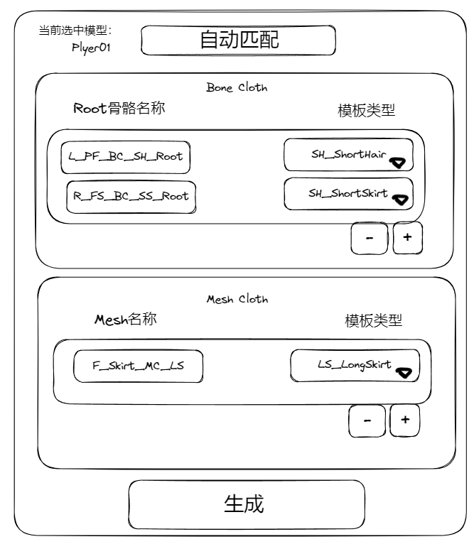
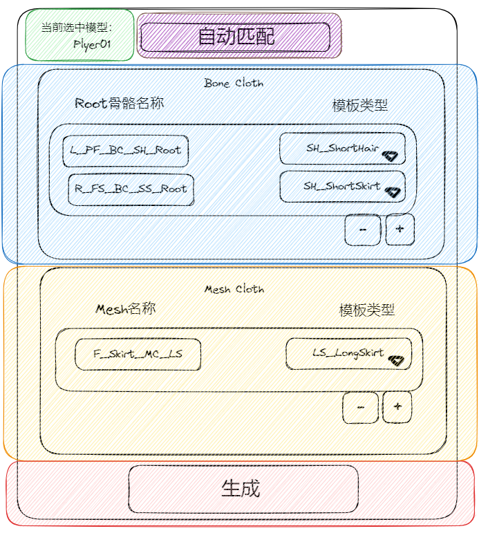
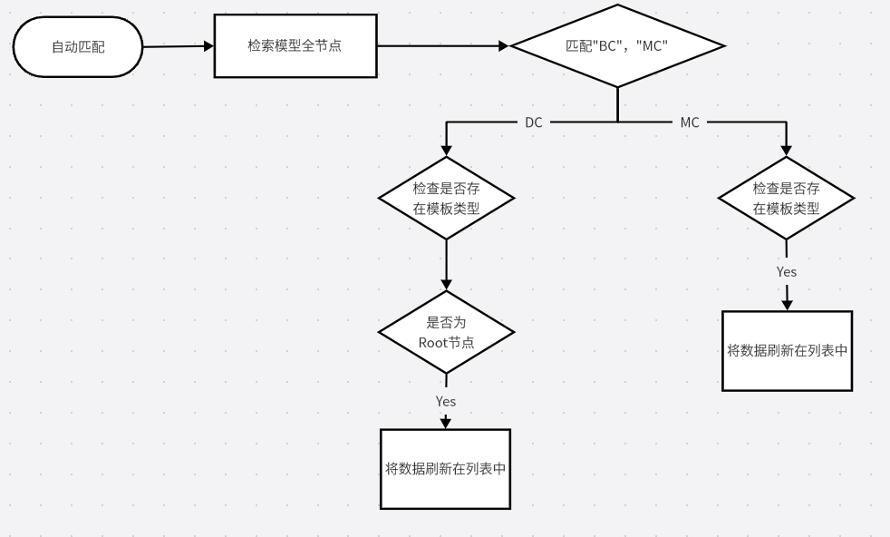

## 一. 目标
减去美术人员，对于模型身上众多挂件以及裙子等物体添加布料插件组件，拾取节点，调整初始参数等繁琐步骤
## 二. 整体方案
对于需要物理模拟的部件骨骼或者网格，制定命名规则，编写MeshCloth辅助插件工具，工具主要功能有自动检索模型命名，将部件名以及对应的模板预设显示在列表，以及基于列表中的骨骼和模型类型添加Magica cloth组件并设置好相应参数

### 2.1 命名规则
#### 2.1.1 骨骼/网格
对于需要使用动态骨骼模拟的，将根骨骼命名格式如下
**"部件名_位置_布料模拟类型_模板类型_Root"** 
对于使用布料模拟的，网格文件命名格式如下
**"部件名_位置_布料模拟类型_模板类型"** 
- 部件名
    - Skirt (裙子)
    - Cape （披风）
    - Tail （飘带）
    - Hair  (头发)
    (不做限制，美术可以自由定义扩展)
- 位置
    - F (正前方)
    - B (正后方)
    - L (正左方)
    - R (正右方)
    - LF (左前方)
    - RF (右前方)
    - LB (左后方)
    - RB (右后方)
- 布料模拟类型
    - MC  (代表使用MeshCloth进行物理模拟)
    - BC （代表使用BoneCloth进行物理模拟）
- 预设模板类型
    - SS (代表SS_ShortSkirt预设模板)
    - LS (代表LS_LongSkirt预设模板)
    - A (代表A_Accessor预设模板)
    （预设模板可随时更新添加，对于新建模板必须是"缩写_全名"格式保存）
### 2.2 功能描述

- **信息（绿色区域)**
    显示目前选中模型的根节点名称
- **自动匹配 (紫色区域)**
    将检索目标所有节点将符合规则内节点信息显示在对应列表中
- **Bone Cloth 列表(蓝色区域)**
    可手动添加元素，并输入骨骼名称，以及设置所需模板类型。在自动匹配后，所有名称具有BC标识的节点将会显示在此列表中,并且可以更改其模板类型
- **Mesh Cloth 列表(黄色区域)**
    可手动添加元素，并输入网格名称，以及设置所需模板类型。在自匹配后，所有名称具有MC标识的节点将会显示在此列表中,并且可更改其模板类型
- **生成 (红色区域)**
    根据Bone Cloth 列表，Mesh Cloth 列表信息，在根节点下级新建空物体并且添加相关组件及设置参数
### 2.3 流程描述

