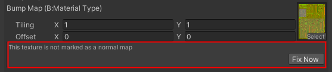

## Shader介绍
目前将局内与局外分给了两套Shader，用于兼顾局内游戏性能以及局外的展示效果
### 局外Shader
现目前局外共5个Shader，LobbyPBR,LobbyEyes,LobbyHair,LobbySkin,LobbyEyelash
#### Lobby PBR
Shader路径:
"Engine/Character/LobbyPBR"

| 参数名  |功能说明 |                 
| --- | :---: | ---: |                                
| Cull Mode  |  剔除模式(None：不剔除，Front：前面，Back：背面) | 
| Base Map | RGB：Base Col , A: 裁剪通道 |
| Alpha Test Enabled  | 开启透明裁剪 |
| Alpha Cutoff  | 透明裁剪 |
| MRAE Map Enabled  | 开启MRAE Map(不开启可以手动设置各通道参数) |
| MRAE Map| R:金属度 G:粗糙度 B:AO A:自发光|
| Metallic  | 金属度 |
| Smoothness  | 光滑度 |
| Occlusion Strength  | AO |
| Emission Color  | 自发光颜色 |
| Bump Map Enabled  | 开启Normal Map |
| Bump Map  | 多维子材质开启下B:IDMap |
| Fresnel Power  | 菲涅耳范围 |
| Fresnel Scale  | 菲涅耳强度 |
| Fresnel Color  | 菲涅耳颜色 |
| Multiple Materials Enabled | 多维子材质开关 |
| Use Materials  | 根据材质ID开启区域颜色控制|
| Color  | ID区域颜色控制 |

- 需要换色功能需开启Multiple Materials Enabled，对于IDMap存储在Normal Map B通道，对于这种自定义修改的法线图，Texture Typed需要设置为Default，Unity会提示更改为Normal对此不需要处理(后期会取消此提示)

#### Lobby Skin
Shader路径:
"Engine/Character/LobbySkin"
| 参数名  |功能说明 |                 
| --- | :---: | ---: |                                
| Cull Mode  |  剔除模式(None：不剔除，Front：前面，Back：背面) | 
| Base Map | RGB：Base Col , A: 曲率通道 |
| Alpha Test Enabled  | 开启透明裁剪 |
| Alpha Cutoff  | 透明裁剪范围 |
| MRAE Map Enabled  | 开启MRAE Map(不开启可以手动设置各通道参数) |
| MRAE Map| R:金属度 G:粗糙度 B:AO A:自发光|
| Metallic  | 金属度 |
| Smoothness  | 光滑度 |
| Occlusion Strength  | AO |
| Emission Color  | 自发光颜色 |
| Bump Map Enabled  | 开启Normal Map |
| Bump Map  | 法线贴图 |
| Fresnel Power  | 菲涅耳范围 |
| Fresnel Scale  | 菲涅耳强度 |
| Fresnel Color  | 菲涅耳颜色 |
| SSS Scale | 次表面散射强度 |
| Second Specular Smooth| 第二层高光光滑度|

- 皮肤材质不支持透明裁剪，及换色功能
#### Lobby Hair
Shader路径:
"Engine/Character/LobbyHair"

| 参数名  |功能说明 |                 
| --- | :---: | ---: |                                
| Base Map | RGB：Base Col , A: 曲率通道 |
| Occlusion Strength  | AO |
| Emission Color  | 自发光颜色 |
| Bump Map Enabled  | 开启Normal Map |
| Bump Map  | 法线贴图 |
| Smoothness  | 光滑度 |
| Anisotropy Intensity  | 各项性异性强度 |
| Specular Noise  | 高光噪波 |
| Specular 1 Intensity  | 高光强度 |
| Specular 1 Color | 高光颜色 |
| Specular 2 Intensity| 高光2 强度|
| Specular 2 Color| 高光2 颜色|
| Specular 2 Offset| 高光2 偏移度|
| Sepcular Field| 第二层高光光滑度|
| Specular Falloff| 高光范围|
| Fading Alpha| 半透明衰减|
| Alpha Cutoff| 透明裁剪范围|

#### Lobby Eyes
Shader路径:
"Engine/Character/LobbySkin"

| 参数名  |功能说明 |                 
| --- | :---: | ---: |                                
| Base Map | RGB：Base Col , A: 曲率通道 |
| Metallic  | 金属度 |
| Smoothness  | 光滑度 |
| Occlusion Strength  | AO |
| Emission Color  | 自发光颜色 |
| Bump Map Enabled  | 开启Normal Map |
| Bump Map  | 法线贴图 |
| Fresnel Power  | 菲涅耳范围 |
| Fresnel Scale  | 菲涅耳强度 |
| Fresnel Color  | 菲涅耳颜色 |
| SSS Scale | 次表面散射强度 |
| Second Specular Smooth| 第二层高光光滑度|

#### Lobby Eyelash
Shader路径:
"Engine/Character/LobbyEyelash"

| 参数名  |功能说明 |                 
| --- | :---: | ---: |                                
| Base Map | Base Col|

### 局内Shader
局内仅一个通用PBRshader，拥有一些局内特效功能
#### CharacterRealtime(待更新)
Shader路径:
"Engine/CustomLit/CustomLitCharacterRealtime"
