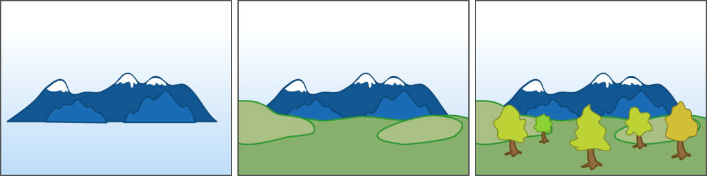
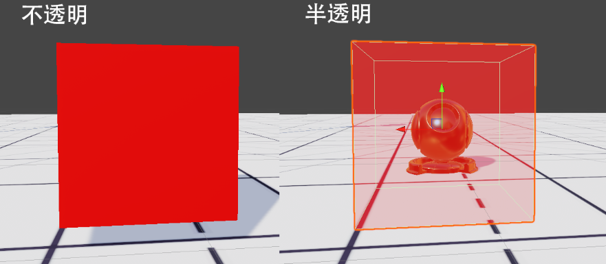

<!--
 * @Description: 
 * @Author: huang zhen,467360906@qq.com
 * @Version: 0.0.1
 * @Date: 2024-02-29 18:08:02
 * @LastEditTime: 2024-05-14 17:17:58
 * @LastEditors: huang zhen,467360906@qq.com
 * Copyright    : G AUTOMOBILE RESEARCH INSTITUTE CO.,LTD Copyright (c) 2024.
-->
# 破晓 - 头发制作指南 v1.0
## 前言
  本文档面向美术制作人员,主要为了让美术制作者能更深入的理解头发材质,能制作出正确的纹理,文档内容包括,**半透明不透明渲染顺序,头发渲染原理,材质参数详解,透明通道制作及调试方法等**,不涉及复杂的渲染管线逻辑及代码,意在通过简单的示例阐述提高美术人员对渲染层面的理解,最终提高制作头发最终品质。
## 简单了解下渲染顺序
  对于头发,经常提到的就是半透明渲染以及随之而来经常出现的渲染顺序错误,要了解渲染顺序以及为什么会出现渲染顺序错误,就先要知道常规默认管线下是按什么顺序如何去绘制图形的
### 不透明物体
  先从不透明物体出发理解,在现实物理世界中,假设我们正在画一幅画,如下图,排除拥有丰富的绘画经验外,我们的绘画顺序应该是
  1. 先画最远的山
  2. 在画较近一些的地面,土坡,遮挡住山体
  3. 再去画离画面更近遮挡住山及地面的树林
  
  
  早期就是根据以上"从远到近处覆盖"思路拓展出,**计算机绘制使用的"画家算法"**,但是仔细思考一下,就能发现这个算法有一个弊端,就是很多被覆盖的地方都已经绘制了从而造成了浪费,在此之后又产生了一种新思路,在正式绘制物体前,根据物体与摄像机的距离,给所有物体在屏幕上投影后的每一个像素写一个编号
  

  然后通过对比编号只**对离摄像机最近的进行渲染**,对于比较编号未通过的我们认为其为**被遮挡区域不进行渲染**,这样就可以达到较高的效率,也可以达到确认渲染顺序的作用,如下图
  

  PS: 在图形学中,这种生成编号的操作,叫做绘制深度缓冲(Z-buffer),对比编号的操作叫做深度测试(Z-Test)
  
### 半透明物体
  现在来说下半透明,半透明与不透明很重要的一个区别就是,哪怕把后面的物体遮挡住了也能看到
  
#### 如何才能完成半透明的渲染呢?
  按之前说到的渲染顺序,如果一个物体写入了深度缓冲中,那么就无法渲染出背后的物体了,所以对于半透明渲染,一个很重要的不同就是**需要不写入深度**,由于没写入深度后面的物体就可以通过深度测试被渲染出来,然后在渲染管线中一般是**先渲染不透明物体再渲染半透明物体**,这样就完成了半透明渲染了
  
  但是在一些复杂的模型或环境下,由于不写深度的操作,渲染顺序问题就会暴露出来
  
  

  **在此提出几个半透明物体的特性,在绘制贴图及设计造型的时候需要多思考**
  - 因为缺少深度的原因,**半透明不能正确投射真实半透明效果的阴影**(虽然有方案,但是代价很大)
  - 半透明相互重叠时,会出现**顺序错误**
## 头发的渲染
  接下来讲本文重点,头发是如何渲染的,因为目前项目中使用的也是市面移动设备主流的双Pass方案,所以就只以该方案进行讲解
  
### 简单了解下什么是Pass,以及什么是双Pass
  - **什么是Pass?**
  Pass简单理解,就是一次渲染,代码中会确定该模型会使用到哪些贴图,该以什么样的光照计算进行渲染
  - **什么是双Pass?**
  双Pass,顾名思义进行两次渲染,在shader我们可以让**同一个物体进行多次渲染**,而且每次都进行不同的计算,还能控制两个Pass之间是以什么方式**进行最终颜色混合**的,类似在PS中,我们可以创建一个图形,复制两个图层然后填充不同的颜色,然后对两个图层之间进行正片叠底,滤色,线性减淡等进行混合,得到期望的颜色
  

### 头发为啥需要用双Pass,以及是如何进行两次渲染的呢?
  因为头发在表现上特别是发梢处希望近似半透明的效果,但是完全半透明的话,又会出现常见的渲染顺序错误问题
  
  此时为了解决如果完全半透明,**渲染顺序会出现错误**以及**没有阴影**缺少体积感的问题等,所以一般就会使用这种叫双Pass的方案
  - 第一次渲染,利用**AlphaTest**也就是常说的透明裁剪或者叫CutOut进行部分裁剪然后写入深度,这样就可以得到大体正确的渲染顺序及阴影了
  - 第二次渲染,按**半透明绘制**颜色,并且叠加到第一次的结果上,这样就可以在保证渲染顺序正确的情况下,又拥有半透明效果了
  
  
## Shader详解

因为部分参数,经过调试基于表现比较好理解,不做多解释
着重讲解**CutOffTips**及**Alpha Cutoff**这两个参数
- **Alpha Cutoff**
对于CutOff的参数究竟要设置到多少?
要思考的是Cutoff控制第一次渲染写入深度的区域,间接影响到的就是**阴影**和之后半透明重叠交叉后会不会有**渲染顺序错误**,据此可以参考几个点
  - 首先是头发型造型大体的阴影细节是否表现出来了
    
  - 其次是否头发在各个角度下,是否会因为裁剪过多,出现明显的半透明顺序错误的问题(为突出表现差异,对原A通道进行过修改)
    

- **CutOffTips**
这个参数是用于处理,发尾到发根半透明程度变化,通过使用normal的A通道控制不同位置的变化强度,**黑色代表不受影响,白色代表受影响**

通过调整参数,控制半透明程度,使发尾处更虚化

### 高光强度

简单说下,对于高光强度,在统一光照情况下,如果参数相差很多,表现就会不统一,有的头发会表现的很亮有的没那么亮,尽可能保持统一的光照表现是加分项
