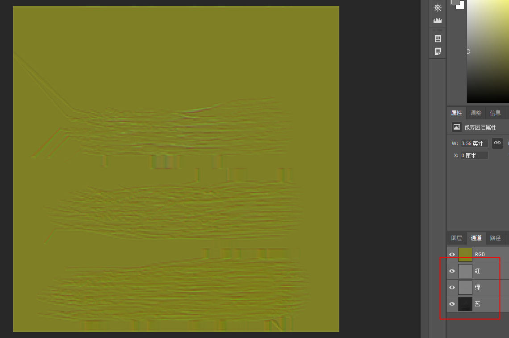

# 头发
如果需要尽快提升头发表现效果，还是建议拿天刀头发来做修改
<video src="%E5%A4%B4%E5%8F%91%E4%BC%98%E5%8C%96.mp4" controls title="Title"></video>
具体差距原因有以下几个方面
- 贴图透明区域与裁剪区域(Cut Out)不清晰
  - 按目前材质设置的0.9的裁剪度
  
  在PS中对透明区域进行阈值调整就可以看到，出现很多断续的线，
  
  这些线会在渲染时候表现出明显的高光不连续
  
  
  - 其次在空隙较大较碎的情况下，目前阴影是无法正确投射的，头发缺少体积感
  
  左图为稍微降低裁剪度至0.5的结果，右图保持0.9的情况
  
  参数对于贴图改变如下，补充了原本断续区域头发
  
  下图为天刀效果，较好的高光连续及较为正确的投影
  
- UV拉伸严重
  
  
- Normal map贴图的设置问题
  现Normal map为自定义烘焙结果，缺少原提交供Normal map的所需要的B通道(用于颜色噪声)用于及A通道(高光噪声拉丝)的信息
  
  
  具体差别如下，下图以便观察调高高光参数
  因为没有A通道的噪声信息，所以高光较为统一没有参差不齐的拉丝
  
  替换贴图后高光，只不过因为透明Cut out影响发丝断续，而影响了最终高光统一的表现
  
  较好的高光表现，及参数调整后的效果应如下
  
- 头发在表现上看面数过低，展示界面为保证质量可以适当增加500-1000面，以便圆滑各个转折面
  
# 皮肤
- SSS效果不明显
  
  对于鼻子，阴影处，颧骨下方都会显得发干
  
  提高SSS强度可以使皮肤更通透
  
  
- 较好的第二层高光可以让角色的皮肤更有质感（第一层高光也就是PBR贴图中的粗糙度可以设置到如下图）
  
  目前第二层高光设置为0，提高至0.5后可以看到明显变化
  
  <video src="/角色渲染/方案设计/角色优化/高光对比.mp4" controls title="Title"></video>
  
# 灯光
- 目前外观界面角色体明暗，体积，颜色等，表现较差，建议先使用目前提供的灯光配置

# URP配置
这两个界面下，LightType都为Indoor所以表现会有差于其他预览界面

