# 角色渲染效果需求整理
## 表现效果需求
### 皮肤（脸部与身体）
#### 整体效果参考
对于皮肤整体表现效果,要达到光照质感柔和皮肤透射效果明显

#### 细节表现
- 阴影和光照交界处会有轻微颜色渐变

- 背面透光效果明显
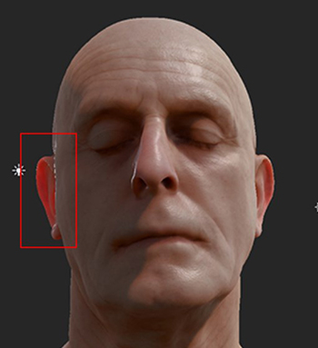
- 对于皮肤高光表现,需要考虑两层以达到较为丰富的细节

### 装备/服装
#### 整体效果参考
- 对于装备/服装的表现效果，要保证材质区分明显，金属有良好的镜面反射效果，保持能量守恒，在统一光源下各种材质表现效果真实统一

#### 细节表现
#### 金属
- 避免出现高光细节表现粗糙，颜色表现单一
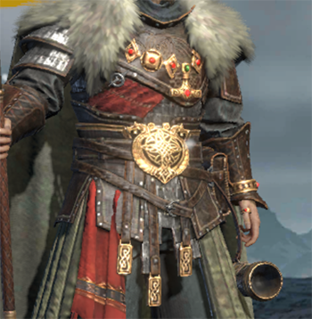
- 避免出现高光油腻,塑料感明显
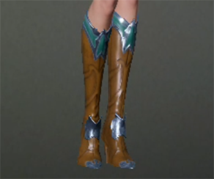

- 对于各类材质(金属,皮革,布料),基于物理参数下都有良好的表现效果以及区别

#### 皮革
- 皮革需满足高光细节层次丰富
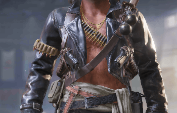
### 眼睛
#### 整体效果参考
- 眼睛需有环境反射效果，明亮通透
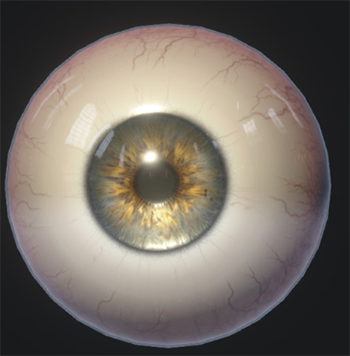
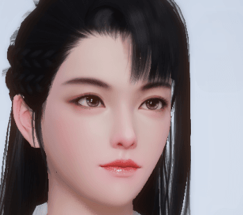
#### 细节
- 除灯光外，需要补充对于摄像机方向的高光反射
- 需添加UV位移功能，用于表情动画
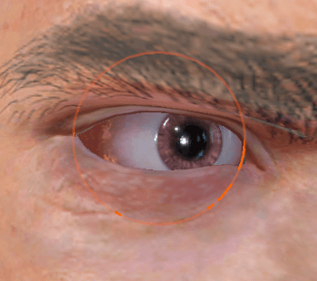
- 暂不考虑眼睛(瞳孔，虹膜)变色
### 头发 （包括胡子）
#### 整体效果参考
- 头发需要拥有各项性异性高光效果,渲染顺序正确不穿插，半透明柔和，需投射阴影至脸部

#### 细节
- 各项性异性高光需表现柔和，避免尖锐高光
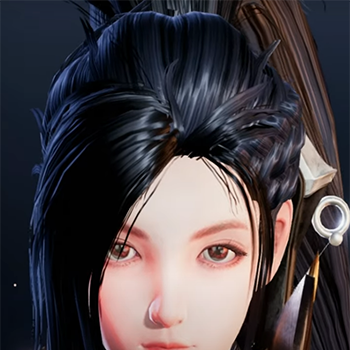
### 角色综合表现
- 角色需支持多光源（可暂定最大灯光数量为3）
- 角色需接收阴影投射，且投射阴影(可暂不考虑点光源阴影)
- 角色接收自阴影需柔和清晰准确，避免明显阴影抖动
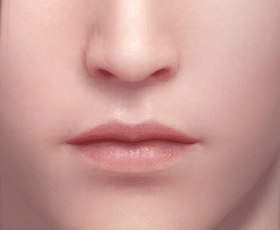
- 对于角色高光处，在合理灯光参数与Bloom设置下不会出现爆闪现象
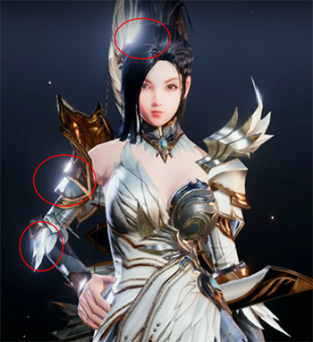
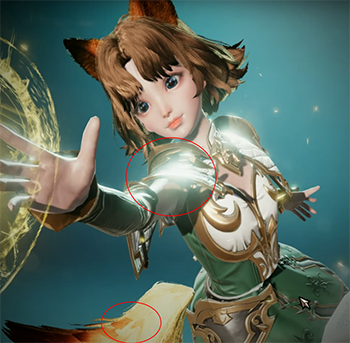
- 在游戏大厅内及展示界面内为角色最高品质，游戏场景内降低渲染品质共给性能
    - 皮肤可去除次表面散射效果
     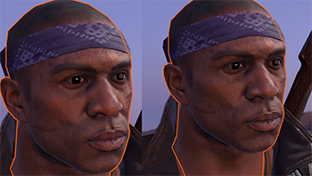
    - 眼睛可以去除环境反射内容,摄像机高光
     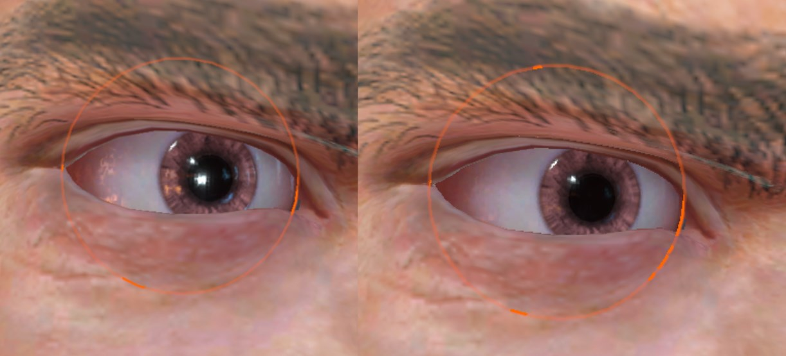
    - 装备/服装等降低光照品质
     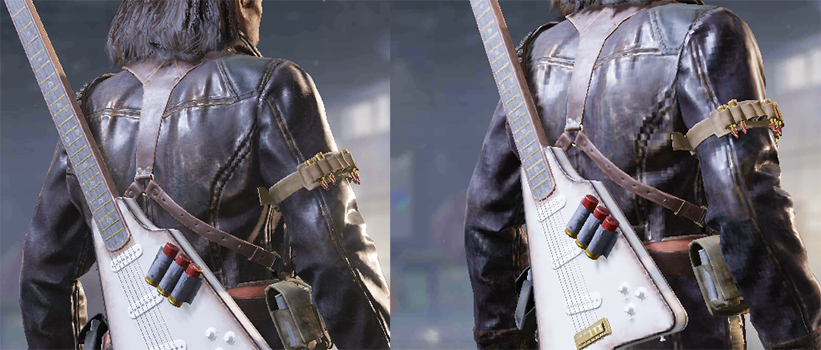
- 除了皮肤，头发外，装备/服装需支持自发光
- 角色最近距离可以缩放到胸口,最远距离可看见全身，保持在两个距离下无明显效果切换或高光闪烁问题
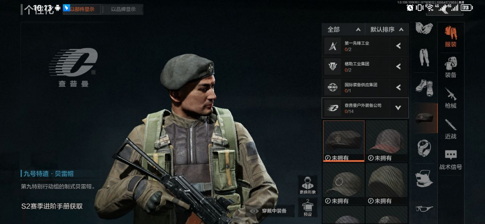
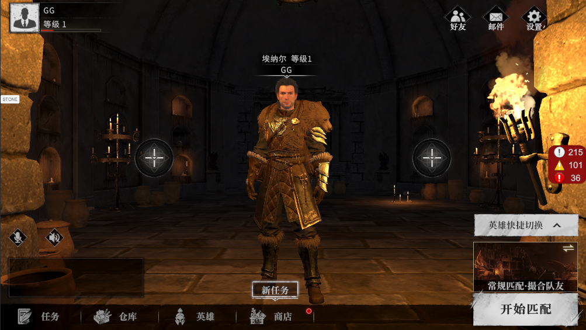
- 头部与身体无明显接缝问题
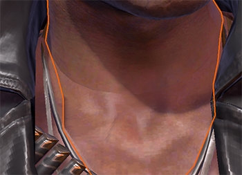
- 对于shader LOD分级需在设定距离下无明显切换痕迹
#### 暂不支持内容
- 角色身上目前只会出现透明裁剪，不会出现半透明部件
- 角色皮肤材质除皮肤外可添加纹身，只能做粗糙度的修改，不可改金属度
- 不考虑妆容，唇彩等效果 
- 不考虑雨天效果
- 不特殊定制宝石，钻石，玻璃镜子材质
- 装备服装暂不考虑各项性异性高光
### 换色功能
#### 材质需要实现对于特定区域换色功能
材质需要实现对于特定区域换色功能
- 对于区域换色，需要能进行颜色更改，以及材质更改，例如：石头变玉石（是否能支持材质更改，待讨论）
- 非用户实时交互功能
### 特效模块（待需求确认）
### 毛发功能（待需求确认） 
## 性能需求
- 在大厅展示界面需保证在最低支持机型(P30等)下能有最高的画面表现效果(最多人数为三人)
- 需考虑峰值18人同屏情况下，不会有渲染压力(合理设置shader LOD分级)
- 游戏场景内保证LOD1范围内的角色有较好的渲染效果
