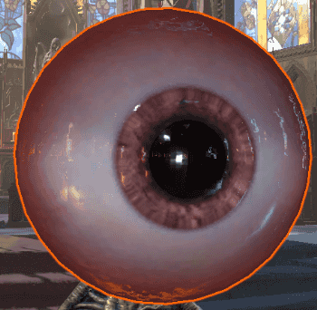
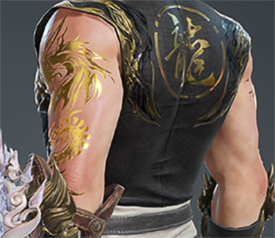
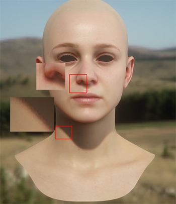
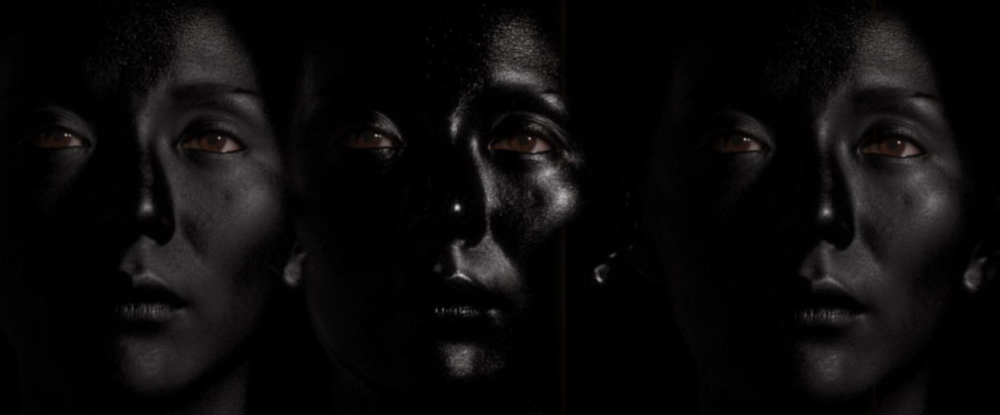
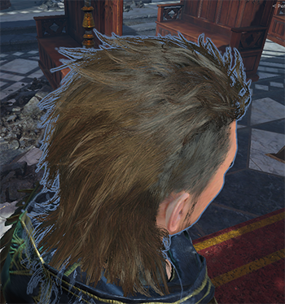

## 角色&怪物基础光照需求
### 一. 渲染着色
#### 1.1 PBR 版本
用于角色皮肤,装备/服装，
- PBR光照模型
- 支持次表面散射皮肤效果 (添加开关，关键字Skin)
- 支持各项性异性高光 
- 支持阴影投射(可暂不考虑用于点光)
- 支持阴影接收
对于头发需要达到较好的半透明效果，不会出现渲染顺序错误，高光细腻柔顺（参考天刀效果）
#### 1.2 Un-PBR 版本
- 眼睛（参考天刀效果）
    - 支持环境球采样
    - 支持眼球UV上下左右移动
    - 支持眼睛与瞳孔放大缩小
    - 摄像机高光

- 毛发(待确认开发)
#### 对于要求标准补充
##### PBR光照模型
- 对于各类材质(金属,皮革,木头等),基于物理参数下都有良好的表现效果

##### 支持多光源(点光)
- 对于点光最大数量，可暂时只考虑到三盏灯
##### 次表面散射
- 对于皮肤次表面效果,光照,质感柔和
- 阴影和光照交界处会有轻微颜色渐变
- 透光效果明显

- 双镜面高光反射

##### 各项性异性高光(双层)
- 主要用于头发拥有较好的头发质感体现

##### 阴影投射
- 暂不考虑点光投影
- 只考虑平行光阴影投射
---
### 二.Shader框架设计
#### 2.1 贴图使用
##### PBR - 服装/装备 & 皮肤 & 头发
- Base Tex (`RGB:Base Color`,`A: Alpha`)
    - Alpha 在在Skin模式下采样曲率图
- Normal Map (`RGB：noraml XYZ `,`A：Emissive`)
- Mask Tex(`R: 金属度`,`G: 粗糙度`,`B: AO`,`A：Mask ID(改色)`)
    - 金属度通道在Skin模式下采样为厚度图 
    - Mask ID：可根据(`0.0 ~ 0.2`,`0.2 ~ 0.4`,`0.4 ~ 0.6`,`0.6 ~ 0.8`,`0.8 ~ 1.0`)分出五个Mask区域，进行区域改色
- EnvCube (用于ibl光照采样)
##### Un-PBR 眼睛
- Diffuse Tex (`RGB:Base Color`,`A: Alpha`)
- Normal Map (`RG：noraml XY`,`B:金属度`,`A：粗糙度`)
- EnvMap (用于ibl光照采样)

#### 2.2 参数设计
##### PBR - Standard
- Cutoff - `裁剪程度`
- Anisotropy - `各项性异性强度`
- SpecCol1 - `各项性异性高光颜色1`
- SpeCol2 - `各项性异性高光颜色2`
- Tint1 - `对应改色区域 Mask 1`
- Tint2 - `对应改色区域 Mask 2`
- Tint3 - `对应改色区域 Mask 3`
- Tint4 - `对应改色区域 Mask 4`
- Tint5 - `对应改色区域 Mask 5`
##### PBR - 皮肤
- Curvalue Scale - `散射范围`
- Curvalue Bias - `散射偏移`
##### Nu-PBR - 眼睛
- Camera Spec Intensity	- `相机高光强度`
- Environment Reflection Tex - `2D 反射球贴图`
- Environment Reflection Intensity - `反射球贴图的强度`
- Specular - `平行光高光强度`
- Eye Size - `缩放虹膜`
- Pupil Size - `缩放瞳孔`
- UV Offset U - `眼球镜像移动`
- UV Offset V - `眼球上下移动`
---
### 三. 性能分级
  根据机型性能，与用户游戏状态(距离，同屏人数等)设定不同的Shader运算品质与种类
#### 3.1 Shader LOD 分级
##### PBR - 服装/装备 & 皮肤 & 头发
- 根据运算性能，每种BRDF分出三档LODLevel，每级性能差别在25%左右
    - BRDF：`BRDF1`,`BRDF2`,`BRDF3`
    - 高光：`GGX`，`Blinn Phone`,`Blinn Phone`
- 根据采样贴图数量，分出三档LODLevel
    - LOD1:`Max 4 Tex`- (`Base Tex`,`Normal Tex`,`Mask Tex`,`EnvCube`)
    - LOD2:`Max 3 Tex`- (`Base Tex`,`Normal Tex`,`Mask Tex`)
    - LOD3:`Max 2 Tex`- (`Base Tex`,`Mask Tex`)
##### Un-PBR - 眼睛
- 根据运算性能，可将高光计算分为三档
    - GGX,Blinn Phone,Blinn Phone
- 根据采样贴图数量，分出三档LODLevel
    - LOD1:`Max 3 Tex`- (`Base Tex`,`Normal Tex`,`EnvCube`)
    - LOD2:`Max 2 Tex`- (`Base Tex`,`Normal Tex`)
    - LOD3:`Max 1 Tex`- (`Base Tex`)
---

### 四. 渲染策略
#### 4.1 按目标场景区分
##### 4.1.1 大厅，展示界面
##### 主角
皮肤 - Shader使用最高品质计算
眼睛 - Shader使用最高品质计算
头发 - Shader使用最高品质计算
装备/服装 - Shader使用最高品质计算
##### ~~NPC~~ 
##### ~~怪物~~
##### 4.1.2 游戏场景内
##### 主角
皮肤 - Shader可视性能低于大厅一级别品质渲染
眼睛 - Shader可视性能低于大厅一级别品质渲染
头发 - Shader可视性能低于大厅一级别品质渲染
装备/服装 - Shader可视性能低于大厅一级别品质渲染
##### 怪物 
非生物怪 - Shader可视性能低于大厅一级别品质渲染
生物怪(精英/Boss) - Shader可视性能低于大厅一级别品质渲染
##### ~~NPC~~

